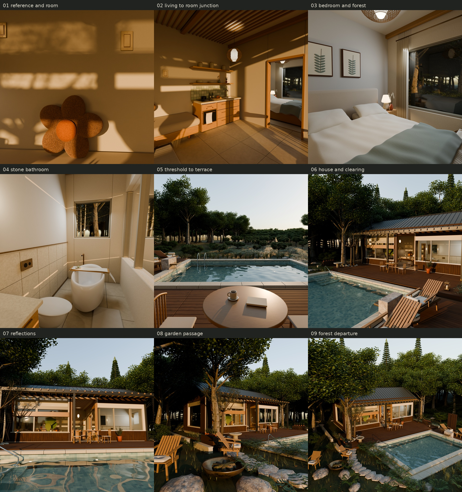
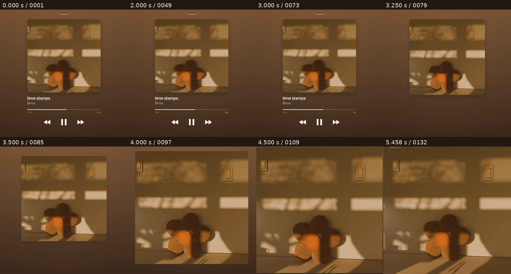

# Golden Hour Companion

Blender / Cycles 森林住宅与电影短片制作项目：从夕阳中的花朵抱枕角落，逐步展开完整室内、门廊、泳池、庭院和森林。仓库包含建模、材质、水面、运镜、渲染与播放器片头的制作源码。



## 观看与下载

当前影片为 v10：59 秒、24 fps、2160 × 2160，无声。Apple Music 风格播放器完整显示 3 秒，然后非线性展开封面，并同步播放封面内的场景。三维场景为 v7，包含九个镜头及三段连续长镜头。

| 文件 | 用途 | 体积 |
| --- | --- | --- |
| [1080 预览](https://github.com/Warren-swr/golden-hour-companion/releases/download/v10.0.0/Golden_Hour_Forest_Retreat_v10_1080_preview.mp4) | 快速观看完整影片 | 35.17 MB |
| [2160 正式影片](https://github.com/Warren-swr/golden-hour-companion/releases/download/v10.0.0/Golden_Hour_Forest_Retreat_v10_2160.mp4) | 高清播放与分享 | 194.91 MB |
| [可编辑场景](https://github.com/Warren-swr/golden-hour-companion/releases/download/v10.0.0/Golden_Hour_Forest_Retreat_v7_scene.zip) | Blender 工程、嵌入贴图、完整水面缓存 | 548.13 MB |

下载入口：[Releases](https://github.com/Warren-swr/golden-hour-companion/releases/tag/v10.0.0)。文件哈希见 [发布资产清单](docs/release-assets.json)。后续默认导出正式 MP4 和轻量预览，按需另行制作专业母版。



## 仓库结构

| 目录 | 内容 |
| --- | --- |
| [tools/](tools/) | 可移植的场景渲染、MP4 导出与公开文件检查入口 |
| [recipes/](recipes/README.md) | 基础场景及 v2–v10 的 204 份历史 Python 制作脚本 |
| [docs/](docs/reproduction.md) | 复现步骤、版本说明、素材来源和核验数据 |
| [media/](media/) | 由项目实际渲染得到的展示图 |

大体积影片和场景通过 Releases 下载。原生帧、历史母版、个人制作配置、日志、字体文件及参考截图保留在本地制作环境，不进入 Git 历史。

## 快速开始

使用 Blender 4.5 LTS、Python 3.11 或更高版本，以及含 ffmpeg / ffprobe 的 FFmpeg。已验证的场景制作版本为 Blender 4.5.12 LTS。

1. 下载并解压场景 ZIP 到 work/scene/，保留 .blend 旁的 cache/ 目录。
2. 用 Blender 打开 work/scene/Golden_Hour_Forest_Retreat.blend，编辑几何、材质、光照和相机。
3. 运行短预览，确认环境可用。

```bash
blender --background work/scene/Golden_Hour_Forest_Retreat.blend --disable-autoexec --python-exit-code 1 --python tools/render_scene.py -- --output work/frames --start 1 --end 24 --resolution 720 --samples 32 --device CPU

python3 tools/encode_video.py --input 'work/frames/frame_%04d.png' --frames 24 --resolution 720 --preview-resolution 360 --output work/video
```

该入口直接生成两个 MP4 和核验记录。GPU 渲染可选择 --device OPTIX 或 --device CUDA；正式输出使用 --resolution 2160，并相应提高采样数。完整场景时间轴为 1–1344 帧、24 fps、56 秒。

详细说明见 [复现与依赖](docs/reproduction.md)。历史播放器片头的 SF Pro 字体需从 Apple 官方获取；仓库提供布局、动画与合成代码。

## 制作与核验

- 场景包含 8107 个对象、约 877 万个网格顶点，12 张贴图已嵌入，水面使用可移植 MDD 缓存。
- 正式影片与预览均完整解码验证为 1416 帧、59 秒，无音轨；三秒停留和展开期间的连续播放已经检查。
- 视觉复查覆盖 143 个抽帧、全部切点、片尾，以及播放器字体和控件的原尺寸细节。

[核验说明](docs/validation.md) · [源码来源索引](docs/source-index.json) · [第三方素材](docs/third-party.md) · [原始建模任务](docs/original-brief.md)

日常渲染和导出使用 tools/；历史 recipes/ 的复跑还需要各版本对应的输入场景与制作状态，详见版本说明。
